# Azure DevOps

The [Azure DevOps MCP Server](https://github.com/microsoft/azure-devops-mcp) is an MCP server created by Microsoft, which allows AI assistants, like GitHub Copilot, to interact with Azure DevOps. This MCP Server supports working with:

- Projects
- Work Items
- Repositories
- Pull Requests
- Branches
- Pipelines
- Test Plans

## Prerequisites

For the purpose of this workshop we will run the MCP server locally, and so you will need the following:

- Node.js (v16+)
- npm or yarn
- Azure DevOps account with appropriate access

## Production Use

For ease of use in this workshop, we will be running the MCP server locally using Stdio,  This is suitable for a single user to work locally with the MCP server.

Currently the Azure DevOps MCP server is in preview, and does not support running remotely using SSE or HTTP Streaming.


## Module Sections

### 1. Add MCP Server to VS Code

#### 1.1 Create MCP.json

- Open the `mcp.json` file in the `.vscode` folder. If this does not exist, create it with the content below:

```json
{
    "inputs": [
    
    ],
    "servers": {
        
    }
}
```

#### 1.2 Authenticate

The Azure DevOps MCP server uses your Entra ID credentials to authenticate to Azure DevOps. Ensure that you have an Azure DevOps Org that is backed by Entra ID, and that you are logged in to the Azure CLI with your Entra ID user and the correct tenant selected.

#### 1.3 Add MCP Server

- In the servers section of the `mcp.json` file, add a new entry for our Azure DevOps MCP Server, replacing the sections in `<>` with your organization and project names:

```json
{
    "inputs": [
        {
            "id": "ado_org",
            "type": "promptString",
            "description": "Azure DevOps organization name  (e.g. 'contoso')"
        }
    ],
    "servers": {
        "ado": {
         "type": "stdio",
         "command": "mcp-server-azuredevops",
         "args": ["${input:ado_org}"]
        }
    }
}
```

- Save the `mcp.json` file

#### 1.4 Start the MCP Server

- Click the start button to start the MCP server inside VS Code.

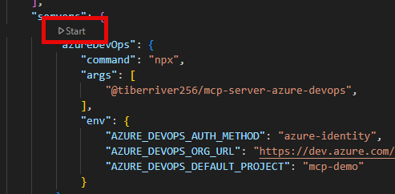

- Azure DevOps should ask you to input your Azure DevOps organisation name. Enter just the org name, not the full URL.

- After a few seconds, the server should show as running

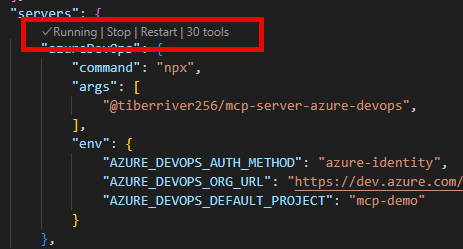

### 2. Use the MCP Server

#### 2.1 Validate MCP Server is Selected

- Make sure you are in Agent Mode in Copilot chat. MCP servers can only be used in Agent Mode

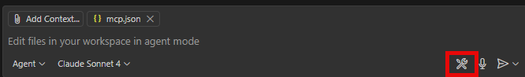

- Select the "configure tool" icon in the bottom right of the chat window
- In the window that opens, scroll down and ensure that the Azure DevOps MCP server and all its tools are enabled

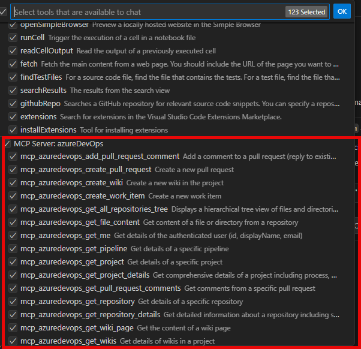

#### 2.1 Query A Work Item

- To use the MCP server we must be in "Agent Mode" in Copilot Chat
- Ask Copilot a question about a work item in Azure DevOps, for example "Tell me about work item with ID 5"
- Copilot will select the appropriate MCP tool to use, and will ask you to consent to using that tool to talk to Azure DevOps

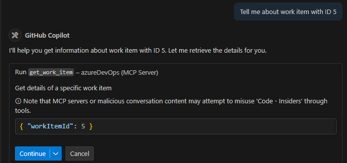

- Click continue, GitHub Copilot should now answer your question about the work item, providing details about the work item and summarizing the work needed.

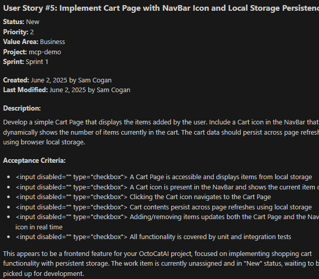

#### 2.2 Change the State of a Work Item

- Interaction with the MCP server is bi-directional, so it can write back to Azure DevOps
- Ask GitHub Copilot to "assign work item number 5 to me, and mark as active"
- GitHub Copilot will show you details of the changes it is going to make, and ask you to approve

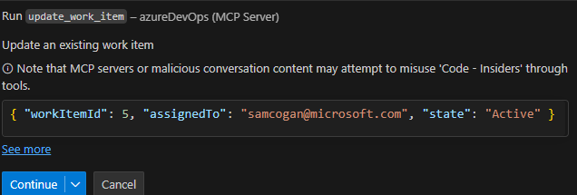

- Once you approve, GitHub Copilot will make the requested changes. You can see the result in GitHub Copilot chat, and in Azure DevOps.

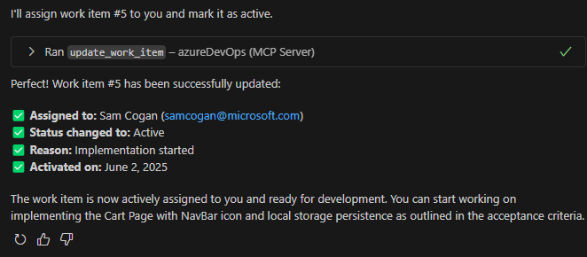

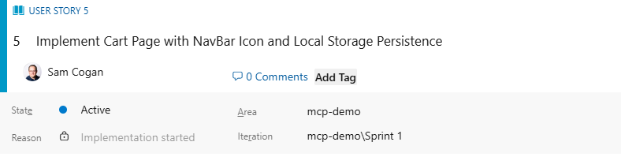

#### 2.3 Work on a Work Item

- GitHub Copilot can use this MCP server for more than just administrative tasks. We can use the MCP server to inform GitHub Copilot of the work we need it to do.
- Ask GitHub Copilot to "Implement Work Item Number 5"
- GitHub Copilot will get the information about the Work Item, including the description and acceptance criteria and use this to implement a solution.
- Once GitHub Copilot is finished updating the code, ask it "have we met all the acceptance criteria", it will retrieve these details from the Work Item and provide a status update

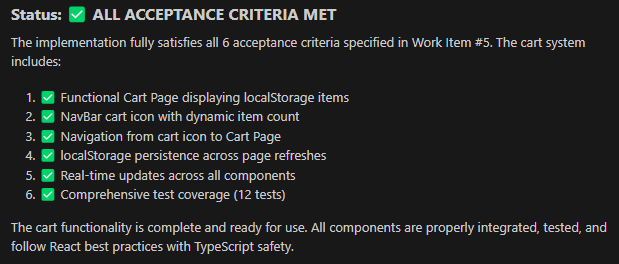

#### 2.4 Close a Work Item

- Now that we know the code has been updated and all acceptance criteria have been met, ask GitHub Copilot to "Update the work item discussion with details of what we have done, and close it".
- GitHub Copilot will ask for consent to update the Work Item, and will then update the details and close it.

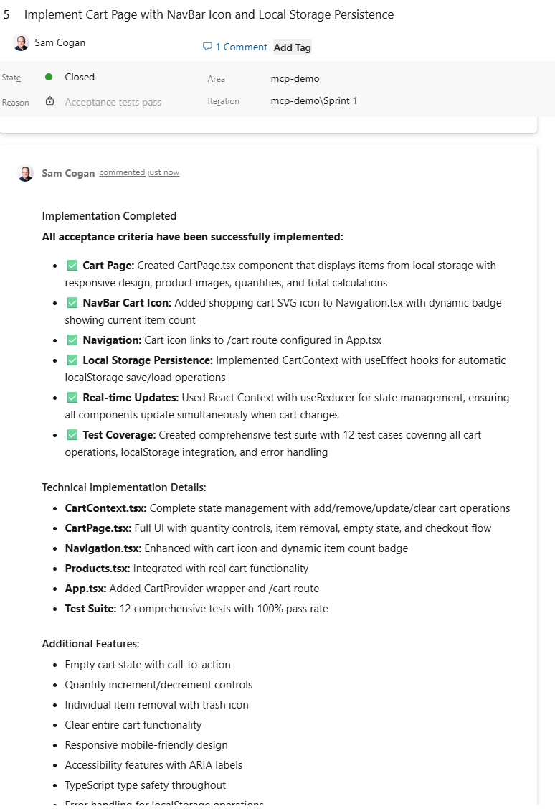

- Make sure you commit your changes to Git to ensure the code is actually updated. If you were using Azure DevOps to store your code, you could also get GitHub Copilot to assist with creating a Pull Request, and even merging it once complete.


## Next Steps

In this workshop we mainly worked with Azure DevOps Work Items, however this MCP server can work with many other ADO resources. You could look into:

- Creating branches and pull requests
- Triggering pipelines and releases
- Creating repositories for new code
- Creating a new bug based on some issues you found in the code
- Summarizing your current workload status for standups
- Enhance or improve Work Item contents
