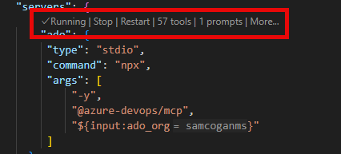

# Azure DevOps

The [Azure DevOps MCP Server](https://github.com/Tiberriver256/mcp-server-azure-devops) is a third party implementation by [Micah Rairdon](https://github.com/Tiberriver256), which allows AI assistants, like GitHub Copilot, to interact with Azure DevOps. This MCP Server supports working with:

- Projects
- Work Items
- Repositories
- Pull Requests
- Branches
- Pipelines

## Pre-Requsites

For the purpose of this workshop we will run the MCP server locally, and so you will need the following instance:

- Node.js (v16+)
- npm or yarn
- Azure DevOps account with appropriate access

## Module Sections

### 1. Add MCP Server to VS Code

#### 1.1 Create MCP.json

- Open the `mcp.json` file in the `.vscode` folder. If this does not exist, create it with the content below:

```json
{
    "inputs": [
    
    ],
    "servers": {
        
    }
}
```

#### 1.2 Generate PAT

To keep things simple, we will use a Personal Access Token (PAT) to access Azure DevOps. You will need to generate this token using the following steps:

- Go to https://dev.azure.com/{your-organization}/_usersSettings/tokens or click on your profile picture > Personal access tokens
- Select "+ New Token"
- Name your token (e.g., "MCP Server Access")
- Set an expiration date
- Select the following scopes:
  - Code: Read & Write
  - Work Items: Read & Write
  - Build: Read & Execute
  - Project and Team: Read
  - Graph: Read
  - Release: Read & Execute
Click "Create" and copy the generated token

#### 1.3 Add MCP Server

- In the servers section of the `mcp.json` file, add a new entry for our Azure DevOps MCP Server, replacing the sections in `<>` with your Organisation and project names:

```json
{
    "inputs": [
        {
            "id": "ado_pat_token",
            "type": "promptString",
            "description": "Azure DevOps Personal Access Token",
            "password": true
        }
    ],
    "servers": {
        "azureDevOps": {
            "command": "npx",
            "args": [
                "@tiberriver256/mcp-server-azure-devops",
            ],
            "env": {
                "AZURE_DEVOPS_PAT": "${input:ado_pat_token}",
                "AZURE_DEVOPS_AUTH_METHOD": "pat",
                "AZURE_DEVOPS_ORG_URL": "https://dev.azure.com/<Azure DevOps Organisation Name>",
                "AZURE_DEVOPS_DEFAULT_PROJECT": "<Azure DevOps Project>"
            }
        }
    }
}
```

- Save the `mcp.json` fiels

#### 1.4 Start the MCP Server

- Click the start button to the start the MCP server inside VS Code.


- Azure DevOps should ask you to input your PAT, enter this in the text box and hit enter.

- After a few seconds, the server should show as running



### 2. Use the MCP Server

#### 2.1 Validate MCP Server is Selected

- Make sure you are in Agent Mode in Copilot chat. MCP servers an only be used in Agent Mode


- Select the "configure tool" icon in the bottom right of the chat window
- In the window that opens, scroll down and ensure that the Azure DevOps MCP server and all it's tools are enabled


#### 2.1 Query A Work Item

- To use the MCP server we must be in "Agent Mode" in Copilot Chat
- Ask Copilot a question about a work item in Azure Devops, for example "Tell me about work item with ID 5"
- Copilot will select the appropriate MCP tool to use, and will as you to consent to using that tool to talk to Azure DevOps


- Click continue, GitHub Copilot should now answer your question about the work item, proividing details about the work item and summarising the work needed.


#### 2.2 Change the State of a Work Item

- Interaction with the MCP server is two, so it can write back to Azure DevOps
- Ask GitHub Copilot to "assign work item number 5 to me, and mark as active"
- GitHub Copilot will show you details of the changes it is going to make, and ask you to approve

¬[Update Consent](images/mcp-update-consent.png)

- Once you approve, GitHub Copilot will make the requested changes. You can see the result in GitHub Copilot chat, and in Azure DevOps.


#### 2.3 Work on a Work Item

- GitHub Copilot can use this MCP server for more than just administrative tasks. We can use the MCP server to inform GitHUb Copilot of the work we need it to do.
- Ask GitHub Copilot to "Implement Work Item Number 5"
- GitHub Copilot will get the information about the Work Item, including the description and acceptance criteria and use this to implement a solution.
- Once GitHub Copilot is finished updating the code,  ask it "have we met all the acceptance criteria", it will retrieve these details from the Work Item and provide a status update


#### 2.4 Close a Work Item

- Now that we know the code has been updated and all acceptance criteria have been met, ask GitHub Copilot to "Update the work item discussion with details of what we have done, and close it".
- GitHub Copilot will ask for consent to updte the Work Item, and will then update the details and close it.


- Make sure you commit your changes to Git to ensure the code is actually updated. If you we're using Azure DevOps to store your code, you could also get GitHub Copilot to assist with creating a Pull Request, and even merging it once complete.